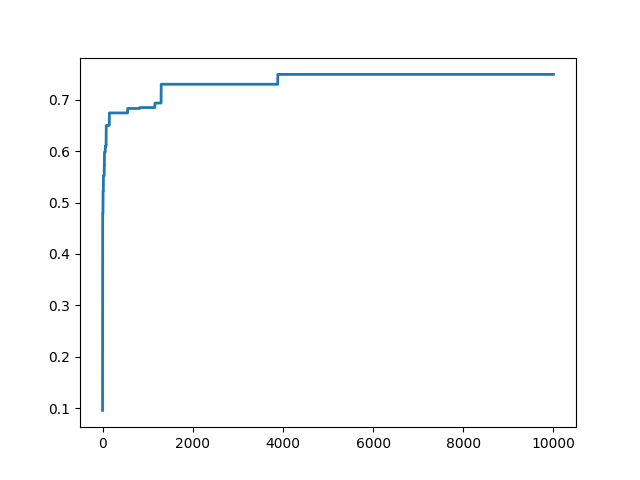
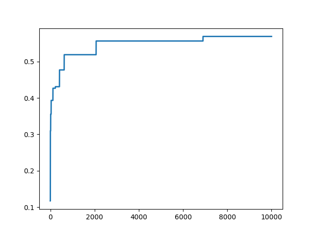

# HW3: 3D reconstruction

## Q1: 8-point and 7-point algorithm (40 points)

### (A1) F matrix using 8-point algorithm (15 points)

 * Epipolar lines:  
 1. Chair  
      
 2. Teddy  
      

* Estimated F  
Foundamental Matrix for chair:  
[[ 1.25682908e-07  2.04037829e-06 -8.18156810e-04]  
 [-3.02922328e-06  2.93471731e-07  1.75381341e-02]  
 [-3.68943624e-05 -1.78325507e-02  1.00000000e+00]]  
Foundamental Matrix for teddy:  
[[ 1.27285868e-07 -4.57717559e-08  6.67579893e-04]  
 [-4.96411756e-07 -3.13172765e-07 -3.96609523e-03]  
 [-1.85248054e-03  4.53297156e-03  1.00000000e+00]]

 * Brief explanation.
   1. Data Preparation: Obtain at least 8 point correspondences between two images.
   2. Normalization: Compute the centroid and the average distance of the points from the centroid for both sets of points. Apply a normalization transformation to both sets of points to move the centroid of the points to the origin and scale the points so that their average distance from the origin
   3. Matrix Construction: Formulate a matrix (A) with each row constructed from a point correspondence
   4. Singular Value Decomposition (SVD): Perform Singular Value Decomposition on matrix (A). Extract the column of (V) corresponding to the smallest singular value, and reshape to get F_hat
   5. Enforce Singularity: Conduct SVD on F_hat. Set the smallest singular value in Sigma to zero, and then calculate the corrected Fundamental Matrix (F)
   6. Denormalization: Denormalize the Fundamental Matrix (F) by applying the inverse of the normalization transformations used in step 2.

### (A2) E matrix using 8-point algorithm (5 points)

* Estimated `E`.  
Essential Matrix for chair:  
[[  0.25179337   4.08769758   2.4337315 ]  
 [ -6.06875144   0.5879418   35.64846225]  
 [ -6.06626294 -35.81023687   1.        ]]  
Essential Matrix for teddy:  
[[  -5.36975574    1.93095394  -31.7198445 ]  
 [  20.9419153    13.21168858  185.53695326]  
 [  77.11314674 -180.20769233    1.        ]]
 
* Brief explanation.
  1. Computing the Fundamental Matrix ( F ) using the Eight-Point Algorithm: Initially, the points are converted to homogeneous coordinates. The points are then normalized. A matrix ( A ) is constructed from the point correspondences. Singular Value Decomposition (SVD) is applied to ( A ) to find ( F ). The singularity constraint is enforced on ( F ). Finally, ( F ) is un-normalized.
  2. Computing the Essential Matrix ( E ) from the Fundamental Matrix ( F ) and the intrinsic matrices ( K_1 ) and ( K_2 ): The formula ( E = K2^T. F. K1 ) is used to compute ( E ) from ( F ), ( K1 ), and ( K2 ). ( E ) is then normalized by dividing it by the element in the last row and last column of ( E ).
  3. Conversion of 2D coordinates to homogeneous coordinates: A set of 2D coordinates is converted to homogeneous coordinates by appending a 1 to each point.

### (B) 7-point algorithm (20 points)

 * Epipolar lines visualisation  

1. Toy bus  
      
2. Toy train  
      
   
 * Brief explanation of your implementation.
   1. Execution of Seven-Point Algorithm to Compute Fundamental Matrix ( F ): This function implements the Seven-Point Algorithm to compute the Fundamental Matrix ( F ). It normalizes the points, constructs matrix ( A ) from point correspondences, applies Singular Value Decomposition (SVD) to ( A ) to find two matrices ( f1 ) and ( f2 ), and then solves a polynomial equation to find the coefficients that linearly combine ( f1 ) and ( f2 ) to get the possible solutions for ( F ). It returns a list of all possible ( F ) matrices.
   2. Conversion to Homogeneous Coordinates: The points p1 and p2 are converted to homogeneous coordinates.
   3. Selection of the Best Fundamental Matrix: Given a list of possible ( F ) matrices, this function selects the one that minimizes the epipolar error by computing the mean epipolar error for each ( F ) and returning the one with the smallest error.

## Q2: RANSAC with 7-point and 8-point algorithm (20 points)

 * Visualization (graph plot) of % of inliers vs. # of RANSAC iterations for the 7-pt and 8-pt Algorithms in the inner loop of RANSAC.
 * plot the epipolar lines fundamental matrix calculated over the inliers.

 1. Chair-8 point  
      
 2. Chair-7 point  
      
 3. Teddy-8 point  
      
 4. Teddy-7 point  
      
 5. Toy bus-8 point  
      
 6. Toy bus-7 point  
      
 7. Toy train-8 point  
      
 8. Toy train-7 point  
      
   
 * Brief explanation of RANSAC implementation and criteria for considering inliers.
   1. Random Selection of Point Pairs: Randomly select either 7 or 8 pairs of points.
   2. Temporary Fundamental Matrix Calculation: Compute a temporary Fundamental Matrix (temp_F) using the selected point pairs via either the Eight-Point or Seven-Point Algorithm
   3. Inlier Counting: Count the number of inliers by identifying the points for which the error is less than a specified error threshold (error_threshold).
   4. Iteration: Repeat steps 1 to 3 for a specified number of iterations (num_iter) to identify the set of point pairs that yields the maximum number of inliers.
   5. Final Fundamental Matrix Calculation: Utilize the identified point pairs from the best iteration to compute the final Fundamental Matrix ( F ).
   

## Q3: Triangulation (20 points)

* Colored point cloud:

 

* Brief explanation of implementation.
  1. Skew Matrix Conversion Function: This function converts a set of points to skew-symmetric matrices. It separates the x, y, and z coordinates, and constructs skew-symmetric matrices for each point, returning an array of these matrices.
  2. Triangulation Function: This function performs triangulation to obtain 3D coordinates from corresponding points in two images. It first converts the points pts1 and pts2 to skew-symmetric matrices using the skew function. It computes two sets of constraint matrices by multiplying the skew-symmetric matrices of points with the camera matrices p1 and p2. It then iterates through these constraint matrices, stacking two rows from each, to form a matrix A. Singular Value Decomposition (SVD) is performed on A to obtain the homogeneous coordinates of the 3D point. The 3D point is then converted to inhomogeneous coordinates and added to the list of 3D points.

## Q4: Reconstruct your own scene! (20 points)

-  Multi-view input images.
-  A gif to visualize the reconstruction of the scene and location of cameras (extrinsics).

  1. Example 1  
            
  2. Example 2  
           

## Q5: Bonus 1 - Fundamental matrix estimation on your own images. (10 points)

- Epipolar lines.
  1. Example 1  
     
  2. Example 2  
     
  
- Brief explanation of your implementation.
  1. SIFT (Scale-Invariant Feature Transform) Object Creation: sift = cv.SIFT_create(). A SIFT object is created using OpenCV's SIFT_create method which will be used for keypoint detection and descriptor computation.
  2. Grayscale Conversion: gray1 = cv.cvtColor(im1, cv.COLOR_BGR2GRAY). gray2 = cv.cvtColor(im2, cv.COLOR_BGR2GRAY). The input images im1 and im2 are converted to grayscale using OpenCV's cvtColor method, as SIFT operates on grayscale images.
  3. Keypoint Detection and Descriptor Computation: kp1, des1 = sift.detectAndCompute(gray1, None).  kp2, des2 = sift.detectAndCompute(gray2, None).  The detectAndCompute method of the SIFT object is used to detect keypoints and compute descriptors for both grayscale images.
  4. Brute-Force Matcher Creation: bf = cv.BFMatcher(cv.NORM_L1, crossCheck=True). A Brute-Force (BF) Matcher object is created using OpenCV's BFMatcher method with L1 norm and cross-check enabled.
  5. Descriptor Matching: The match method of the BF Matcher object is used to find matches between the descriptors of the two images. The matches are then sorted based on their distance attribute, which represents the similarity between matched descriptors, with lower values indicating better matches.
  6. Extraction of Matched Points: The matched points' coordinates are extracted using attributes of the match objects. The coordinates are then converted to homogeneous coordinates
     
